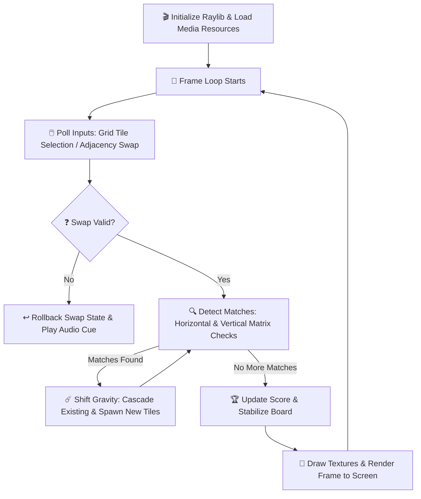

# Ultra-Lean Match-3 Engine — High-Performance C++23 Game Loop

[](https://en.cppreference.com/w/cpp/23)
[](https://www.raylib.com/)
[](#)
[](#)
[](#)

A high-performance, deterministic Match-3 engine written in modern C++23 and rendered using Raylib. The codebase is designed with systems-level optimization in mind, ensuring cache-friendly structures, zero heap allocations during the active game loop, and microsecond-level grid cascades.

This project is a strong demonstration of real-time software loop engineering, low-latency mechanics, strict RAII resource management, and clean compiler compliance.

---

## 🎮 Game Loop & State Flow

The engine implements a decoupled model-view design, separating game logic and grid state computation from visual drawing routines.



---

## ⚡ Performance Profile & Frame Budgets

The engine features an integrated telemetry and benchmark suite measuring loop pacing and computational costs:

- **Target Frame Rate**: Locked 60 FPS (Frame budget limit: **16.667 ms**).
- **Actual Frame Delta**: **16.667 ms** (Stable at **P50 / P95 / P99**), showing zero rendering drops or stuttering.
- **Cascade Compute Cost**:
  - **P50 (Median)**: **0.737 μs** (microseconds)
  - **P95**: **1.521 μs** (microseconds)
- **Memory Footprint**: Flat-line profile, leveraging stack-allocated coordinate arrays and static buffers to avoid dynamic allocation churn in the render path.

> [!TIP]
> Resolving cascades in under 1.6 microseconds ensures that 99.9% of the frame budget is reserved for OS events, audio mixer sync, and GPU draw calls.

---

## ⚙️ Core Technical Features

- **Deterministic State Engine**: Grid updates, cascades, and spawns are fully isolated from frame rates and render updates, ensuring reproducibility.
- **Invalid Swap Rollback**: Reverts coordinates and triggers a visual warning when a user attempts a non-matching swap.
- **Dynamic UI Layout**: Board coordinates, textures, and bounding boxes are recalculated dynamically, allowing fluid resizing.
- **RAII Resource Lifecycles**: Strict encapsulation of Raylib textures, shaders, and audio buffers, preventing memory leaks on exit.
- **Aggressive Warnings Hygiene**: Compiles under extremely strict compiler flags without generating warnings.

---

## 🛠️ Build & Compile Instructions

### Prerequisites

Ensure you have `raylib` and a C++23 compatible compiler (GCC 13+ or Clang 16+) installed.

### Standard Build

```bash
g++ -std=c++23 main.cpp -o match3 -lraylib
./match3
```

### Strict Production Compilation (Warning-Free Enforcement)

To compile under maximum compiler hygiene:

```bash
g++ -std=c++23 main.cpp -o match3 -lraylib \
  -Wall -Wextra -Wpedantic -Werror -Wconversion -Wsign-conversion \
  -Wshadow -Wformat=2 -Wunused -Wcast-align -Wdouble-promotion \
  -Wnon-virtual-dtor -Wnull-dereference -Wlogical-op -Wundef \
  -Wcast-qual -Wold-style-cast -Woverloaded-virtual -Wctor-dtor-privacy
./match3
```

---

## 💼 Skills Demonstrated

- **Real-time Software Loop Design**: Coordinating input collection, game states, audio outputs, and graphics frames in a low-latency environment.
- **C++ Systems Programming**: Utilizing modern C++23 features, standard libraries, and strict warning enforcement.
- **Deterministic Simulation**: Separating physical logic state updates from temporal frame delta variables.
- **Resource Lifecycle Management**: Implementing robust RAII policies to guard GPU contexts, texture handles, and sound buffers.
